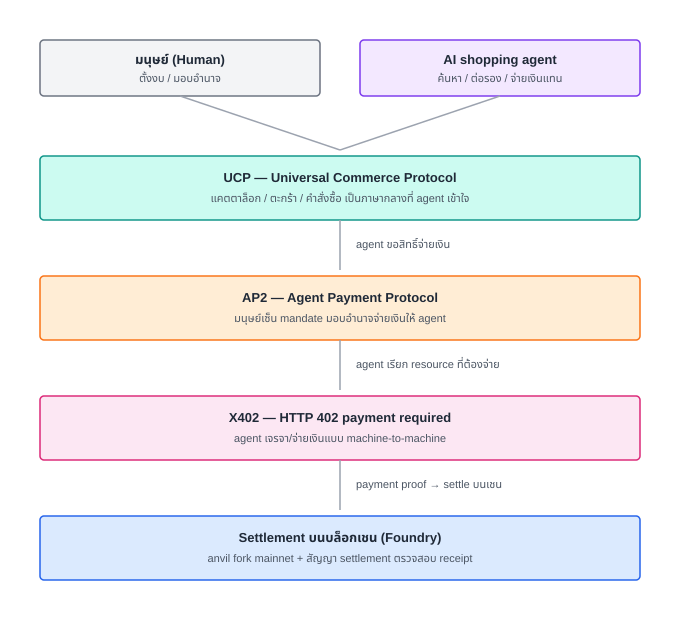
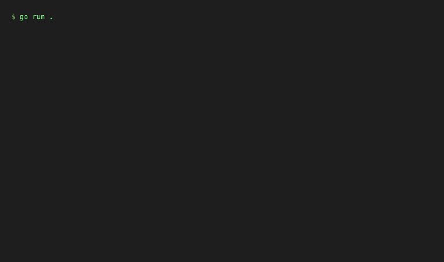
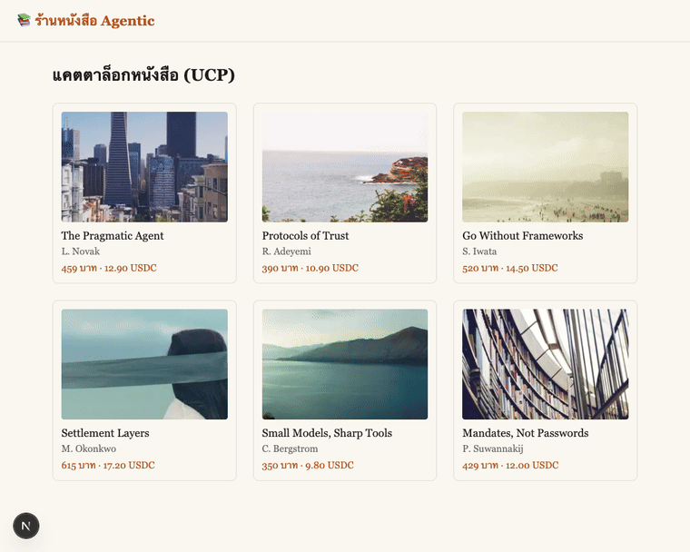
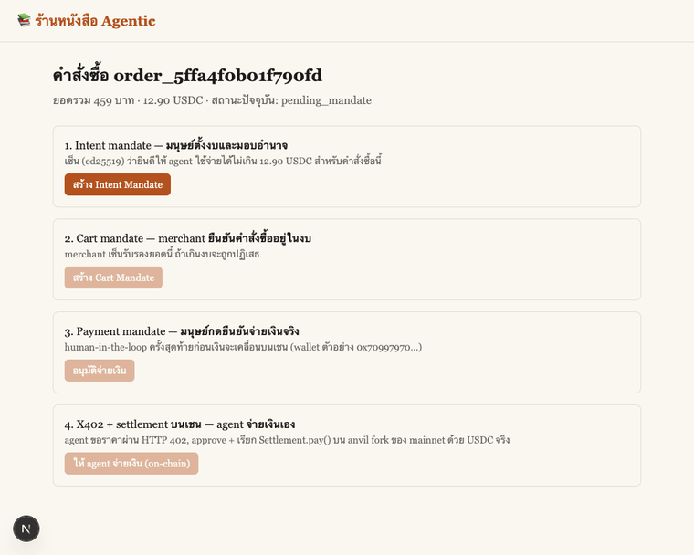
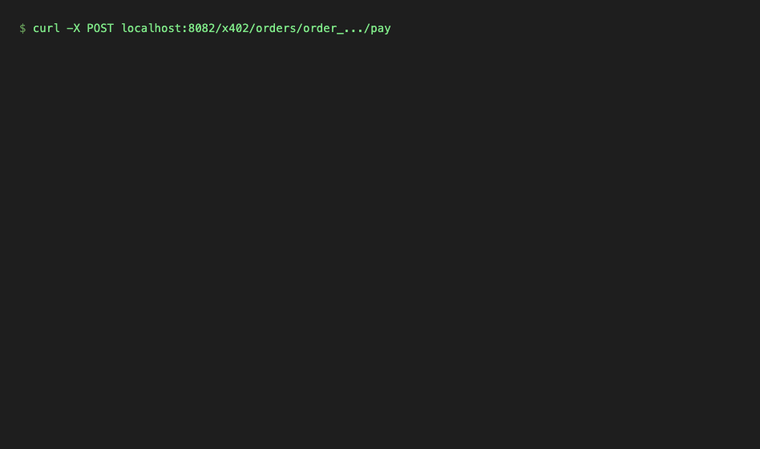
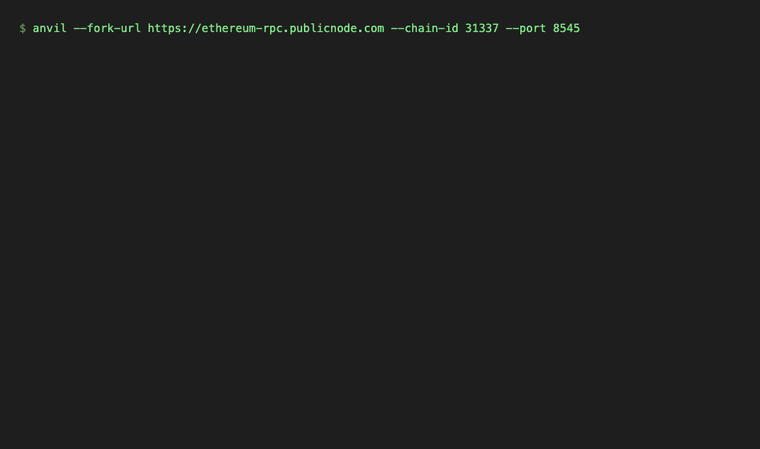

# ร้านหนังสือ Agentic Commerce — UCP → AP2 → X402 → Settlement บนบล็อกเชน

Workshop ที่สอนสร้างระบบร้านหนังสือที่ **AI agent ซื้อของแทนมนุษย์ได้จริง**
ตั้งแต่ค้นหนังสือจนเงิน USDC เข้าร้านบนบล็อกเชนจริง (anvil fork จาก
Ethereum mainnet ด้วย Foundry) — ไม่มีขั้นตอนไหนเป็น mock



## สแตก

| ส่วน | เทคโนโลยี |
|---|---|
| Backend | Go (`net/http` stdlib ล้วน, ไม่มี dependency ภายนอก) |
| Frontend | Next.js (App Router) + Tailwind |
| Agent wallet | shells out to `cast` (Foundry) — ดู [lesson 6](docs/lesson-06.md) |
| Payment protocol | UCP → [AP2](https://github.com/google-agentic-commerce/AP2) mandates (ed25519) → [X402](https://x402.org) |
| Settlement | Solidity (`Settlement.sol`) บน anvil fork ของ mainnet, USDC จริง |

## บทเรียน

| # | เรื่อง | Demo |
|---|---|---|
| 0 | [ภาพรวมหลักสูตร](docs/00-ภาพรวม-หลักสูตร.md) | — |
| 1 | [UCP: แคตตาล็อกและตะกร้า (Go backend)](docs/lesson-01.md) |  |
| 2 | [UCP: หน้าร้าน Next.js](docs/lesson-02.md) |  |
| 3 | [AP2: Intent → Cart → Payment Mandate](docs/lesson-03.md) |  |
| 4 | [X402: agent จ่ายเงินแบบ machine-to-machine](docs/lesson-04.md) |  |
| 5 | [Settlement บนบล็อกเชน (Foundry fork mainnet)](docs/lesson-05.md) |  |
| 6 | [Agent self-checkout: ประกอบร่างทั้งระบบ](docs/lesson-06.md) |  |

แต่ละบทมี **เป้าหมาย, เรียนไปทำไม, สิ่งที่สร้าง, ไดอะแกรม, และ
ทางเลือกอื่นที่พิจารณา** — ไม่ใช่แค่ "ทำตามนี้" อ่านตามลำดับได้ที่โฟลเดอร์
[`docs/`](docs/)

## รันเอง (local)

### 1. Foundry (anvil fork mainnet)

```bash
foundryup
anvil --fork-url https://ethereum-rpc.publicnode.com --chain-id 31337 --port 8545
```

### 2. Deploy Settlement.sol

```bash
cd contracts
forge install foundry-rs/forge-std --no-commit
export MERCHANT_WALLET_ADDRESS=<เลือก address ใดก็ได้จาก anvil>
forge script script/Deploy.s.sol --rpc-url http://127.0.0.1:8545 \
  --private-key <anvil account 0 private key> --broadcast
```

คัดลอก address ที่ deploy ได้ใส่ `.env` เป็น `SETTLEMENT_CONTRACT_ADDRESS`
(ดู [`contracts/README.md`](contracts/README.md) สำหรับวิธี fund test
wallet ด้วย USDC จริงจาก mainnet fork)

### 3. Backend

```bash
cd backend
go run .
```

รันที่ `:8080` อ่าน `../.env` อัตโนมัติ — ตั้ง `AGENT_PRIVATE_KEY` เพื่อ
ให้ปุ่ม "ให้ agent จ่ายเงิน" (lesson 6) ใช้งานได้

### 4. Frontend

```bash
cd frontend
npm install
cp .env.local.example .env.local
npm run dev
```

เปิด `http://localhost:3000`

## สร้าง gif เอกสารเอง (reproducible docs)

```bash
# รัน anvil + backend + frontend ให้พร้อมก่อน (ports 8545, 8080, 3000)
cd docs/scripts
npm install
node capture.mjs
```

ดูรายละเอียดที่ [lesson 6](docs/lesson-06.md)

## โครงสร้างโปรเจกต์

```
backend/    Go: UCP catalog/cart/order + AP2 mandates + X402 + agent wallet
frontend/   Next.js: ร้านค้า + หน้า mandate chain + ปุ่ม agent checkout
contracts/  Foundry: Settlement.sol, ทดสอบกับ mainnet fork จริง
docs/       บทเรียนภาษาไทย + diagrams (svg) + gifs + capture script
```
