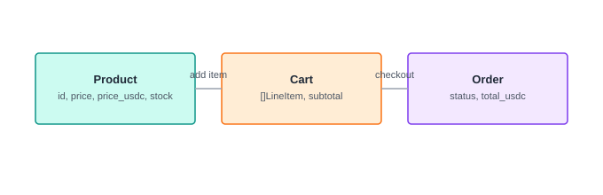

# บทที่ 1 — UCP: แคตตาล็อกและตะกร้า (Go backend)

## เป้าหมาย

สร้าง backend Go แบบ zero-dependency ที่ expose "พื้นผิวการค้า" (commerce
surface) ตามแนวคิด [UCP (Universal Commerce Protocol)](https://ucp.dev):
แคตตาล็อกสินค้า, ตะกร้า, และจุดส่งต่อไปเป็นคำสั่งซื้อ — endpoint ชุดเดียว
ที่ทั้งมนุษย์ (ผ่านหน้าร้านบทที่ 2) และ agent (บทที่ 6) เรียกเหมือนกันทุก
ประการ

## เรียนไปทำไม

หัวใจของ agentic commerce คือ **agent กับมนุษย์ต้องคุยกับร้านผ่านภาษา
เดียวกัน** ถ้า backend ทำ endpoint แยกสำหรับ "คนคลิก" กับ "agent เรียก"
โค้ด business logic จะเพี้ยนออกจากกันทันที (เช่น เช็ค stock คนละที่)
บทนี้จึงวางรากฐาน: มี `Catalog`, `CartStore`, `OrderStore` เป็นแหล่งความ
จริงเดียว แล้วให้ทุกอย่างในบทถัดไป (มนุษย์คลิกปุ่ม, agent ยิง HTTP)
เรียกฟังก์ชันเดิมเป๊ะ

## สิ่งที่สร้าง

- [`backend/catalog.go`](../backend/catalog.go) — `Product` มีทั้งราคา THB
  (`Price`) และราคา USDC 6 ทศนิยม (`PriceUSDC`) เพราะบทที่ 5 จะ settle
  ด้วย USDC จริงบนเชน ไม่ใช่บัตรเครดิต
- [`backend/cart.go`](../backend/cart.go) — `AddItem` เป็น mutation จุด
  เดียวที่ clamp จำนวนตาม stock, ทั้งมนุษย์และ agent ต้องผ่านฟังก์ชันนี้
- [`backend/orders.go`](../backend/orders.go) — `Order` คือจุดแช่แข็ง
  cart ให้เป็นยอดที่แก้ไม่ได้แล้ว พร้อม field ว่างสำหรับ mandate chain
  (บทที่ 3) และ tx hash (บทที่ 5) ที่จะเติมทีหลัง
- [`backend/main.go`](../backend/main.go) — `net/http.ServeMux` ธรรมดา
  ไม่มี framework, มี middleware logging/CORS สั้น ๆ

## สถาปัตยกรรมข้อมูล



## ทางเลือกอื่นที่พิจารณา

- **ใช้ framework เช่น Gin/Echo** — ปัดตกเพราะ endpoint มีแค่ 6-7 เส้น
  `net/http` เวอร์ชัน Go 1.22+ (มี path parameter ในตัว) เพียงพอ และผู้เรียน
  ไม่ต้องเรียนรู้ framework เพิ่มก่อนจะเข้าใจ UCP
- **เก็บราคาแค่สกุลเดียว** — ปัดตก เพราะบทที่ 2 (หน้าร้านมนุษย์) กับบทที่ 5
  (settle บนเชน) ต้องการหน่วยคนละแบบ การแปลงหน่วยตอนอ่าน (ไม่ใช่ตอนเก็บ)
  ทำให้ราคาทั้งสองสกุล "sync" กันเสมอ

## ทดสอบเอง

```bash
cd backend
go run .
curl localhost:8080/ucp/catalog
```

## ต่อยอดได้อะไร

บทที่ 2 จะสร้างหน้าร้าน Next.js ที่เรียก endpoint พวกนี้ตรง ๆ — ไม่มี
backend-for-frontend คั่นกลาง เพราะ UCP ถูกออกแบบให้เป็น API เดียวที่พอ
อยู่แล้ว
