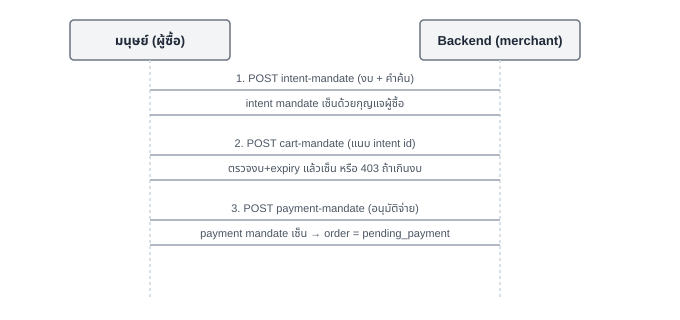

# บทที่ 3 — AP2: Intent → Cart → Payment Mandate

## เป้าหมาย

สร้างห่วงโซ่ mandate 3 ชั้นตามแนวคิด [AP2 (Agent Payment
Protocol)](https://github.com/google-agentic-commerce/AP2): มนุษย์เซ็น
**intent mandate** ตั้งงบ, merchant เซ็น **cart mandate** ยืนยันว่าคำสั่ง
ซื้ออยู่ในงบ, แล้วมนุษย์เซ็น **payment mandate** อนุมัติจ่ายเงินจริงเป็น
ขั้นสุดท้าย — ทั้งหมดเซ็นด้วย ed25519

## เรียนไปทำไม

ถ้าไม่มี AP2 การให้ "agent จ่ายเงินแทนมนุษย์" (บทที่ 6) จะเป็นแค่การส่ง
private key ให้ agent ถือ ซึ่งไม่มีขอบเขตและตรวจสอบย้อนหลังไม่ได้ AP2
แก้ปัญหานี้ด้วยการแยก **"มนุษย์อนุญาตอะไร"** (intent) ออกจาก
**"merchant เสนออะไร"** (cart) และ **"มนุษย์ยืนยันจ่ายจริงหรือยัง"**
(payment) — แต่ละมนุษย์เซ็นเฉพาะสิ่งที่ตัวเองรับผิดชอบ ทำให้ตรวจสอบย้อน
หลังได้ว่า agent ทำเกินขอบเขตที่ได้รับอนุญาตหรือไม่

## สิ่งที่สร้าง

- [`backend/mandate.go`](../backend/mandate.go) — 3 struct
  (`IntentMandate`, `CartMandate`, `PaymentMandate`) แต่ละอันมี
  `Payload` (JSON ที่ถูกเซ็น) และ `Signature` (ed25519, hex-encoded)
- `handleCartMandate` **ปฏิเสธ** ถ้า order เกินงบของ intent mandate หรือ
  intent mandate หมดอายุแล้ว — จุดบังคับใช้ (enforcement point) ที่แท้จริง
- `handlePaymentMandate` ต้องมี cart mandate ที่ merchant เซ็นแล้ว
  เท่านั้นถึงจะสร้างได้ และเมื่อสร้างเสร็จ order จะเปลี่ยนสถานะเป็น
  `pending_payment` — เปิดทางให้บทที่ 4 (X402) ทำงานต่อ
- หน้า [`frontend/app/order/[id]/page.tsx`](../frontend/app/order/[id]/page.tsx)
  ขั้นที่ 1-3 คือ UI ของบทนี้

## ลำดับการทำงาน



## ความง่ายที่ตั้งใจทำ (และข้อจำกัด)

กุญแจ "ผู้ซื้อ" กับ "merchant" ถูกสร้างและเก็บไว้ **ในโปรเซส backend
เดียวกัน** (`userPub/userPriv`, `merchantPub/merchantPriv` ใน
`mandate.go`) เพื่อให้ห่วงโซ่ทั้งหมดตรวจสอบได้ในที่เดียวสำหรับ workshop
นี้ ของจริง **ผู้ซื้อต้องถือกุญแจของตัวเอง** (เช่นใน wallet app) และเซ็น
intent/payment mandate จากฝั่ง client ไม่ใช่ให้ backend เซ็นแทน — การ
เซ็นแทนแบบนี้เท่ากับ backend ปลอมลายเซ็นผู้ซื้อได้ ซึ่งขัดกับเจตนาของ
AP2 โดยตรง ถ้าจะขยายให้ถูกต้อง ต้องย้ายการเซ็น intent/payment mandate
ไปที่ frontend (ใช้ WebCrypto หรือ wallet extension เซ็น) แล้วส่งแค่
signature มาให้ backend verify เท่านั้น

## ทดสอบเอง

```bash
curl -X POST localhost:8080/ap2/intent-mandate \
  -d '{"query":"programming books","max_total_usdc":50000000}'
```

## ต่อยอดได้อะไร

บทที่ 4 (X402) จะปฏิเสธการขอราคาทันทีถ้า order ยังไม่มี payment mandate
— mandate chain จากบทนี้คือ "ใบผ่านทาง" เข้าสู่การจ่ายเงินจริง
