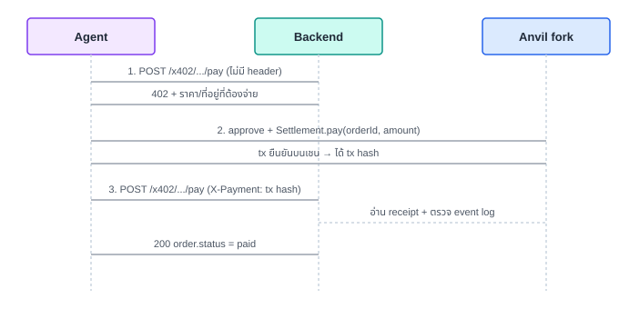

# บทที่ 4 — X402: agent จ่ายเงินแบบ machine-to-machine

## เป้าหมาย

ใช้ [HTTP 402 Payment Required](https://x402.org) เป็นภาษากลางระหว่าง
agent กับ merchant server: ยิง request เปล่า ๆ ไปก่อนจะได้ราคาที่ต้อง
จ่ายกลับมา แล้ว retry พร้อมหลักฐานการจ่ายเงินในภายหลัง — ไม่มีมนุษย์
คลิกอะไรในบทนี้เลย ทุกอย่างเป็นการเจรจาระหว่างเครื่องกับเครื่อง

## เรียนไปทำไม

บทที่ 3 (AP2) ให้ "ใบอนุญาต" agent จ่ายเงิน แต่ยังไม่ได้บอกว่า *กลไก*
การจ่ายเงินจริงหน้าตาเป็นอย่างไร X402 เติมช่องว่างนี้: เป็น protocol
ระดับ HTTP ที่เบาที่สุดเท่าที่จะทำได้สำหรับ "ราคาเท่านี้ จ่ายที่นี่ แล้ว
พิสูจน์มาว่าจ่ายแล้ว" — ไม่ผูกกับ payment rail ใดรายหนึ่ง (จะเป็นบัตร,
USDC, หรืออย่างอื่นก็ได้) ทำให้ agent framework ทั่วไปที่รู้จัก HTTP 402
คุยกับร้านนี้ได้โดยไม่ต้องรู้จัก AP2 หรือ Settlement.sol เลยด้วยซ้ำ

## สิ่งที่สร้าง

- [`backend/x402.go`](../backend/x402.go) — `handleX402Pay` เช็ค 2 เงื่อนไข
  ก่อนอื่น: มี payment mandate หรือยัง (ปฏิเสธด้วย 403 ถ้ายัง — X402 ไม่ใช่
  ทางลัดข้าม AP2), แล้วมี header `X-Payment` หรือยัง
  - **ไม่มี** → ตอบ `402 Payment Required` พร้อม JSON `accepts[]`
    (แบบย่อของ x402 spec): ราคา, สัญญาที่ต้องจ่าย, asset (USDC)
  - **มี** → อ่าน tx receipt จริงจาก anvil แล้วเทียบ event log
- ค่าคงที่ `orderSettledTopic0` คือ keccak256 hash ของ event signature
  ที่คำนวณไว้ล่วงหน้าด้วย `cast keccak` (ดู `contracts/README.md`) เพื่อ
  ไม่ต้อง implement Keccak-256 เองใน Go

## ลำดับการเจรจา

## บั๊กที่เจอจริงตอนสร้างบทนี้ (คุ้มค่าที่จะเล่า)

ตอน verify event log ครั้งแรก โค้ดพยายามอ่าน `data` เป็น 2 คำ (64 ไบต์)
โดยคิดว่า `orderId` กับ `amount` อยู่ใน `data` ทั้งคู่ — แต่ `OrderSettled`
ประกาศ `orderId` และ `payer` เป็น `indexed` ทำให้ทั้งสองไปอยู่ใน
`topics` ไม่ใช่ `data`, เหลือแค่ `amount` คำเดียวใน `data` โค้ดที่คาด
ความยาวผิดจึง `continue` ข้ามทุก log เงียบ ๆ (ไม่ throw error) กว่าจะรู้
ต้อง `cast receipt` ดู raw log จริงเทียบกับสิ่งที่โค้ด parse — บทเรียน:
**เทส event verification ต้องรันกับ tx จริงเสมอ อย่าเดาโครงสร้าง log**

## ทางเลือกอื่นที่พิจารณา

- **ใช้ facilitator service แยกต่างหาก (ตาม x402 spec เต็มรูปแบบ)** —
  ปัดตกสำหรับ workshop นี้ เพราะ agent เรียก settlement contract เองตรง
  ๆ อยู่แล้ว (บทที่ 6), การมี facilitator คั่นกลางจะเพิ่มความซับซ้อนโดย
  ไม่ได้สอนอะไรเพิ่มในบริบทนี้ — เอกสารระบุ trade-off นี้ไว้ในโค้ดแล้ว

## ต่อยอดได้อะไร

บทที่ 5 สร้างสัญญา `Settlement.sol` ที่ปล่อย event `OrderSettled` ซึ่ง
เป็นสิ่งที่บทนี้รออ่านอยู่ และบทที่ 6 ปิดวงจรด้วยการให้ agent เป็นคนยิง
ทั้งสอง request ของ diagram ข้างบนเอง
