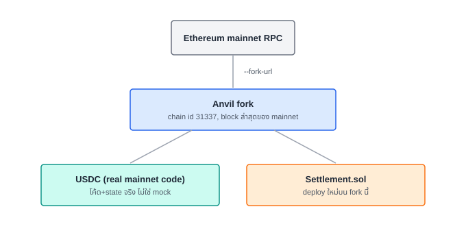

# บทที่ 5 — Settlement บนบล็อกเชน (Foundry fork mainnet)

## เป้าหมาย

เขียนสัญญา `Settlement.sol` ที่ดึง USDC จากผู้จ่ายไปยัง merchant "ครั้ง
เดียวต่อหนึ่ง order" แล้ว deploy บน anvil node ที่ **fork มาจาก Ethereum
mainnet จริง** — ไม่ใช่เชนเปล่า ๆ ที่ deploy fake token ขึ้นมาเอง

## เรียนไปทำไม

โจทย์ของ workshop นี้ระบุไว้ชัดว่าให้ "ดึงข้อมูล mainnet มาไว้แล้ว" การ
ทดสอบกับ token ปลอมที่เราคุมทุกอย่างเองไม่พิสูจน์อะไรเลยว่าโค้ดนี้จะ
ทำงานกับ USDC จริง — bytecode จริง, decimals จริง, พฤติกรรม
`transferFrom` จริง (ซึ่งบาง token มี quirk เช่น USDT ที่ไม่ return bool)
การ fork mainnet ทำให้เทสของเราวิ่งกับสิ่งที่ deploy จริงบน mainnet โดย
ไม่เสี่ยงเงินจริงสักบาท

## สิ่งที่สร้าง

- [`contracts/src/Settlement.sol`](../contracts/src/Settlement.sol) —
  `pay(orderId, amount)` เรียก `transferFrom` แล้ว mark `paid[orderId] =
  true` ก่อนปล่อย event `OrderSettled` (checks-effects-interactions:
  กัน reentrancy ทำสัญญาสับสนเรื่อง state) เรียกซ้ำ orderId เดิมจะ revert
  ด้วย `AlreadyPaid`
- [`contracts/test/Settlement.t.sol`](../contracts/test/Settlement.t.sol) —
  `forge test --fork-url` seed USDC ให้ payer ด้วยการ `vm.prank` เป็น
  whale wallet จริงบน mainnet (ไม่ใช่ mock) แล้วพิสูจน์ทั้ง happy path
  และ replay-protection
- [`contracts/script/Deploy.s.sol`](../contracts/script/Deploy.s.sol) —
  deploy script ที่พิมพ์ address ออกมาให้ก็อปใส่ `.env`

## สถาปัตยกรรม fork



## วิธีขอ USDC มาทดสอบโดยไม่ใช้เงินจริง

`anvil_impersonateAccount` คือ cheat code ที่ทำงานได้เฉพาะบน local fork
เท่านั้น — สั่งให้ node "เป็น" wallet ที่อยู่บนนั้นจริง (เช่น wallet
แลกเปลี่ยนที่ถือ USDC เยอะ) ได้โดยไม่ต้องมี private key เลย เพราะ anvil
ควบคุม state ทั้งหมดในเครื่องเราเอง เมื่อ impersonate แล้วสั่ง `transfer`
USDC จริงก็ย้ายมาที่ wallet ทดสอบของเราได้ทันที — วิธีนี้ **ใช้ได้เฉพาะ
local fork** เท่านั้น ทำแบบนี้บน mainnet จริงไม่ได้และไม่ควรทำ

รายละเอียดคำสั่งทั้งหมดอยู่ที่ [`contracts/README.md`](../contracts/README.md)

## ทางเลือกอื่นที่พิจารณา

- **Deploy fake USDC (ERC20 ธรรมดา) บนเชนทดสอบเปล่า** — ปัดตกตามที่อธิบาย
  ข้างบน ไม่พิสูจน์อะไรกับของจริง
- **Pattern "pull payment" (payer เรียก pay เอง) เทียบกับ "push"
  (merchant ดึงเงินเอง)** — เลือก pull (payer เรียก `pay`) เพราะ agent
  เป็นฝ่าย initiate การจ่ายอยู่แล้วจาก X402 (บทที่ 4), ให้ merchant ต้อง
  ยิง tx เองจะเพิ่ม gas cost/complexity ฝั่ง merchant โดยไม่จำเป็น

## ทดสอบเอง

```bash
cd contracts
forge test --fork-url http://127.0.0.1:8545 -vv
```

## ต่อยอดได้อะไร

บทที่ 6 ต่อสายไฟทั้งหมดเข้าด้วยกัน: agent เป็นคนเรียก `approve` +
`pay()` บนสัญญานี้เองผ่านปุ่มเดียวในหน้าเว็บ
