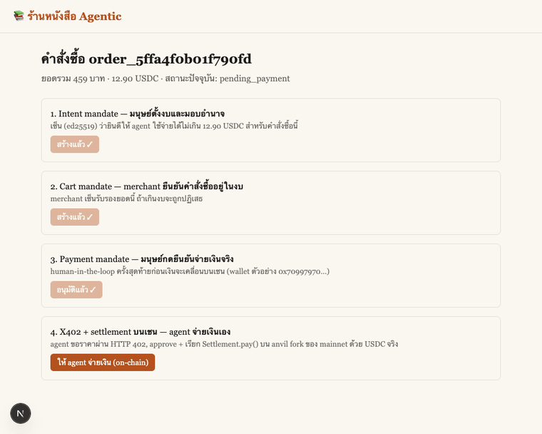

# บทที่ 6 — Agent self-checkout: ประกอบร่างทั้งระบบ

## เป้าหมาย

ปิดวงจรทั้งหมดด้วยปุ่มเดียว: `POST /agent/orders/{id}/checkout` ให้
**agent เป็นคนถือ wallet และจ่ายเงินเอง** — ไม่ใช่มนุษย์เชื่อม MetaMask
ในเบราว์เซอร์ นี่คือหัวใจของคำว่า "agentic" ใน agentic commerce: agent
มี custody ของเงินและตัดสินใจจ่ายเองภายในขอบเขตที่ AP2 mandate อนุญาต

## เรียนไปทำไม

บทที่ 1-5 สร้างทุกชิ้นส่วนแยกกัน (catalog, mandate, X402, contract)
บทนี้พิสูจน์ว่าชิ้นส่วนเหล่านั้น **ประกอบกันเป็นระบบที่ใช้งานได้จริง**
ไม่ใช่แค่ endpoint ที่เทสแยกกันผ่าน ระบบ agentic commerce ของจริงต้อง
ให้ agent ดำเนินการได้ end-to-end โดยมนุษย์แค่ตั้งขอบเขต (บทที่ 3) แล้ว
ปล่อยให้ agent ทำงานต่อ — ไม่ใช่ให้มนุษย์กดปุ่มทุกขั้นตอนของ payment
rail เอง

## สิ่งที่สร้าง

- [`backend/agent.go`](../backend/agent.go) — `AgentWallet` shell ออกไป
  เรียก `cast` (มากับ `foundryup` อยู่แล้ว) แทนที่จะ vendor
  secp256k1+RLP signer เข้ามาใน Go backend ที่ตั้งใจไม่มี dependency
  ภายนอก — `handleAgentCheckout` เรียก `handleX402Pay` **ในโปรเซสเดียวกัน**
  ผ่าน `responseRecorder` (ไม่ยิง HTTP หาตัวเอง) แล้วววนตามลำดับ: ขอ
  quote → approve → pay → verify
- ปุ่ม "ให้ agent จ่ายเงิน (on-chain)" ใน
  [`frontend/app/order/[id]/page.tsx`](../frontend/app/order/[id]/page.tsx)
  คือจุดเดียวที่มนุษย์แตะ hardware ในกระบวนการทั้งหมด

## ลำดับการทำงานแบบเต็ม

เทียบกับภาพรวมทั้งระบบที่ [docs/diagrams/00-architecture.svg](diagrams/00-architecture.svg) —
บทนี้คือการเดินจากบนลงล่างของภาพนั้นในคำสั่งเดียว

## Demo

ภาพก่อน/หลังกดปุ่ม "ให้ agent จ่ายเงิน" จริง — สถานะเปลี่ยนจาก
mandate ครบ 3 ใบ ไปเป็น `paid` พร้อม tx hash จริงบน anvil fork

## ยืนยันแล้วว่าทำงานจริง

รันจริงผ่านเบราว์เซอร์ (ไม่ใช่แค่ curl): catalog → หยิบหนังสือใส่ตะกร้า
→ สร้างคำสั่งซื้อ → สร้าง 3 mandate ทีละขั้น → กด "ให้ agent จ่ายเงิน" →
สถานะเปลี่ยนเป็น `paid` พร้อม tx hash จริงบน anvil fork ของ mainnet
ด้วย USDC จริง (ดูวิธี fund wallet ทดสอบที่บทที่ 5)

## ทางเลือกอื่นที่พิจารณา

- **ให้มนุษย์เชื่อม wallet เอง (MetaMask) แล้วจ่ายเอง** — ปัดตก เพราะขัด
  กับเจตนา "agent จ่ายแทนมนุษย์" ของทั้ง workshop, และเพิ่ม dependency
  ฝั่ง frontend (wallet connector, chain switching) ที่ไม่ตรงโจทย์
- **ให้ agent เซ็น raw transaction ด้วย Go signer เอง** — พิจารณาแล้วแต่
  เก็บไว้เป็นการบ้านต่อยอด (ดู "ต่อยอดได้อะไร") เพราะ `cast` ทำให้บทเรียน
  โฟกัสที่ protocol layer (UCP/AP2/X402) แทนที่จะเสียเวลากับ
  ECDSA/RLP encoding ซึ่งไม่ใช่ประเด็นของ workshop นี้

## ต่อยอดได้อะไร

- แทนที่ `cast` ด้วย proper wallet SDK (เช่น signer ที่เก็บกุญแจใน HSM/KMS)
  สำหรับ agent ที่ต้องรันใน production จริง
- เพิ่ม policy engine ที่ตรวจสอบ intent mandate หลายใบพร้อมกัน (เช่น
  budget ต่อวัน ไม่ใช่ต่อคำสั่งซื้อ)
- ต่อกับ agent framework ภายนอก (LangChain/OpenAI tool calling) ให้เรียก
  `/agent/orders/{id}/checkout` เป็นหนึ่งใน tool ที่ LLM เลือกใช้ได้เอง
