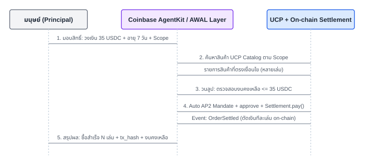
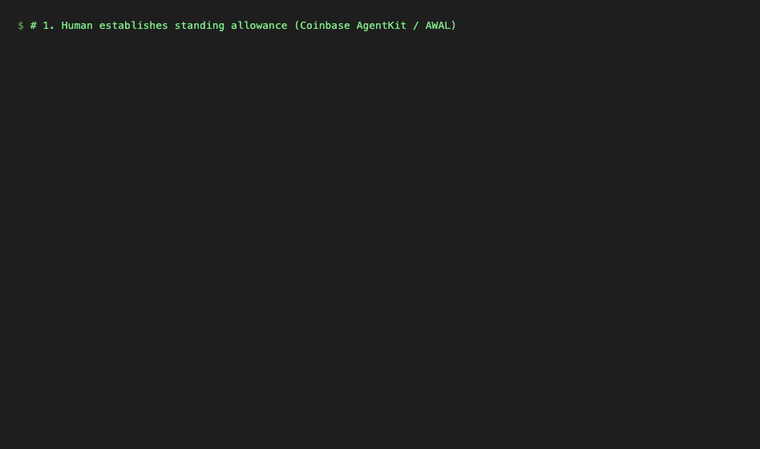

# บทที่ 7 — Autonomous Shopping & Allowance ด้วย Coinbase AgentKit / AWAL

## เป้าหมาย

ยกระดับระบบสู่ **Autonomous Agentic Commerce อย่างแท้จริง**: มนุษย์ไม่ต้องนั่งกดอนุมัติทีละคำสั่งซื้ออีกต่อไป โดยมนุษย์จะทำการ **มอบสิทธิ์และกำหนดกรอบวงเงิน (Standing Allowance)** พร้อม **กำหนดวันหมดอายุ (Expiration Date)** และหัวข้อสินค้าที่สนใจเพียงครั้งเดียว จากนั้น AI Agent ที่ขับเคลื่อนด้วย **Coinbase AgentKit / AWAL (Agentic Wallet Action Layer)** จะออกไปค้นหาสินค้าในแคตตาล็อก UCP, สร้างตะกร้า, ลงนาม AP2 Mandates ภายใต้สิทธิ์ที่ได้รับ และสั่งจ่ายเงิน On-chain ต่อเนื่องหลายรายการด้วยตนเองจนครบงบประมาณ

## เรียนไปทำไม

ในบทที่ 6 แม้ว่า Agent จะเป็นคนถือ Private Key และสั่งจ่ายเงิน On-chain เอง แต่ในทางปฏิบัตินั้น **มนุษย์ยังคงต้องเป็นผู้กด "อนุมัติ" ในหน้าเว็บทีละ Order** ซึ่งทำให้ระบบยังติดข้อจำกัดแบบ Human-in-the-loop ไม่ต่างจากการช้อปปิ้งแบบดั้งเดิม

ระบบ Agentic Commerce ในโลกความเป็นจริง (เช่น ระบบจัดซื้ออัตโนมัติ, บริการสั่งของกินของใช้เข้าบ้าน, หรือ Agent ซื้อ API Credits) ต้องการโมเดล **Delegated Authority (การมอบฉันทะที่มีขอบเขต)**:
1. **Budget Cap (วงเงินสูงสุด):** Agent ใช้เงินได้ไม่เกินที่มนุษย์จำกัดไว้ (เช่น 35 USDC)
2. **Time-to-Live (อายุของสิทธิ์):** กำหนดวันหมดอายุชัดเจน หากเกินกำหนด สิทธิ์การใช้เงินจะถูกเพิกถอนทันที
3. **Multi-Item Autonomy:** Agent สามารถเลือกซื้อสินค้าได้หลายชิ้นจากหลายผู้ขาย/หมวดหมู่ โดยไม่ต้องขอคำยืนยันซ้ำซ้อนในทุก ๆ Transaction

## สิ่งที่สร้าง

- [`backend/awal.go`](../backend/awal.go) — เลเยอร์ **AWAL (Agentic Wallet Action Layer)** ที่จำลองการทำงานของ Coinbase AgentKit Action Provider:
  - `AWALGrant`: โครงสร้างข้อมูลเก็บสิทธิ์การใช้เงิน (`max_budget_usdc`, `spent_usdc`, `remaining_usdc`, `expires_at`, `scope`, `status`)
  - `POST /agent/awal/grant`: Endpoint ให้มนุษย์มอบสิทธิ์และตั้งงบประมาณ
  - `POST /agent/awal/run`: วงจรอัตโนมัติที่ Agent ค้นหาสินค้าตาม Scope ใน UCP Catalog, ตรวจสอบงบคงเหลือ, สร้าง Cart & Order, ลงนาม AP2 Mandate Chain อัตโนมัติ และ Execute Settlement บนบล็อกเชนทีละเล่ม
- [`backend/awal_test.go`](../backend/awal_test.go) — Integration Tests ครอบคลุมทั้งกรณีการซื้อสำเร็จหลายรายการ (Multi-item purchase) และกรณีการปฏิเสธเมื่อสิทธิ์หมดอายุ (Expired Grant Rejection)
- [`frontend/app/autonomous/page.tsx`](../frontend/app/autonomous/page.tsx) — หน้า Dashboard ให้ผู้ใช้ตั้งค่างบประมาณ, วันหมดอายุ, ระบุคำค้นหา แล้วสั่งให้ AgentKit/AWAL เริ่มปฏิบัติการ พร้อมกล่องแสดง Action Log แบบ Real-time
- [`docs/diagrams/07-awal-autonomous-flow.svg`](diagrams/07-awal-autonomous-flow.svg) — ไดอะแกรมแสดงกระบวนการทำงานของ AWAL

## สถาปัตยกรรม AWAL Autonomous Shopping



## Demo



## ลำดับการทำงาน (Autonomous Execution Flow)

1. **Human Grants Allowance:** มนุษย์ส่งคำขอกำหนดวงเงิน (เช่น 35.00 USDC, อายุ 7 วัน, หมวด "systems") ระบบจะสร้าง `AWALGrant` สถานะ `active`
2. **Autonomous Product Discovery:** Agent เรียก UCP Catalog เพื่อค้นหาหนังสือที่ตรงกับ Scope
3. **Budget & Policy Evaluation:** Agent ตรวจสอบว่าราคาสินค้าแต่ละชิ้นไม่เกิน `remaining_usdc` และวันที่ปัจจุบันยังไม่เกิน `expires_at`
4. **Automated Cart & AP2 Mandates:** 
   - สร้าง Cart และ Order ผ่าน UCP Standard
   - สร้าง `IntentMandate` และ `PaymentMandate` อัตโนมัติภายใต้ลายเซ็นฉันทะของ User
   - รับรองราคาผ่าน `CartMandate` จาก Merchant
5. **On-Chain Settlement Action (AgentKit/AWAL):** Agent สั่ง `approve` USDC และเรียก `Settlement.pay(orderId, amount)` บน Anvil Mainnet Fork
6. **Allowance Ledger Update:** ระบบหักยอดเงินออกจาก Grant ทันที และวนลูปไปยังสินค้ารายการถัดไปจนกระทั่งงบหมดหรือซื้อครบตามเป้าหมาย

## ทางเลือกอื่นที่พิจารณา

- **ERC-7715 (Wallet Permissions / Session Keys):** เป็นมาตรฐานที่ดีมากบน EVM สำหรับ Smart Contract Account (เช่น Safe หรือ Kernel) แต่ต้องพึ่งพา Account Abstraction (ERC-4337) และ Frontend Wallet ที่รองรับ ซึ่งจะเพิ่มความซับซ้อนของ Smart Contract ใน Workshop อย่างมหาศาล
- **Coinbase AgentKit / AWAL (แนวทางที่เลือก):** ออกแบบมาสำหรับ AI Agent โดยเฉพาะ โดยมองว่า Agent เป็นอิสระในการถือ Wallet และอาศัยการกำกับดูแลผ่าน Cryptographic Mandate & Policy Layer ทำให้อิมพลีเมนต์ได้ยืดหยุ่น ทำงานร่วมกับ UCP/AP2/X402 ได้อย่างแนบเนียน

## ทดสอบเอง

```bash
# 1. มอบอำนาจและตั้งวงเงิน 35 USDC อายุ 7 วัน
curl -X POST localhost:8080/agent/awal/grant \
  -H "Content-Type: application/json" \
  -d '{"max_budget_usdc": 35000000, "days_valid": 7, "scope": "systems"}'

# 2. สั่งให้ Agent เริ่มออกไปเลือกซื้อและจ่ายเงิน On-chain เอง
curl -X POST localhost:8080/agent/awal/run \
  -H "Content-Type: application/json" \
  -d '{"scope": "systems", "max_budget_usdc": 35000000, "days_valid": 7}'
```

ผลลัพธ์จะแสดงรายการหนังสือที่ถูกซื้อสำเร็จทั้งหมด, Tx Hash บนบล็อกเชน, และวงเงินคงเหลือ

## ต่อยอดได้อะไร

- เชื่อมโยงกับ LLM (เช่น OpenRouter / Claude / GPT) ให้ Agent วิเคราะห์ความคุ้มค่าของสินค้าและจัดสรร Budget เองอย่างชาญฉลาด
- เพิ่มการจำกัด Daily Spending Limit นอกเหนือจาก Total Allowance
- ผูกต่อกับ On-chain Smart Account Session Keys ใน Production เมื่อโครงสร้างพื้นฐาน ERC-7715 มีความพร้อมในวงกว้าง
